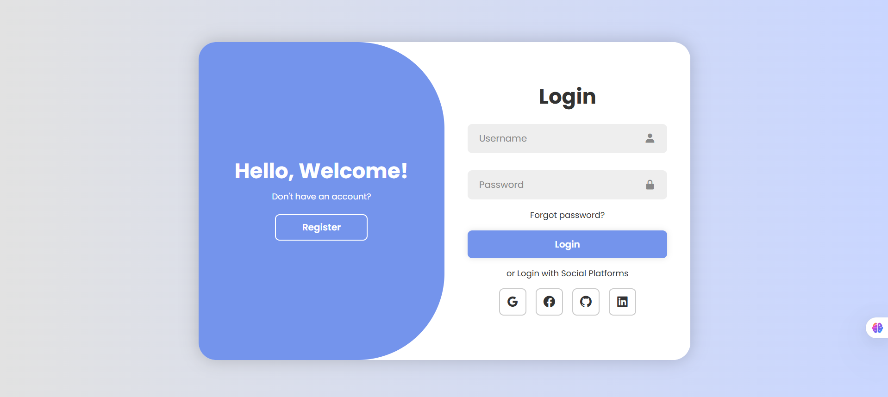
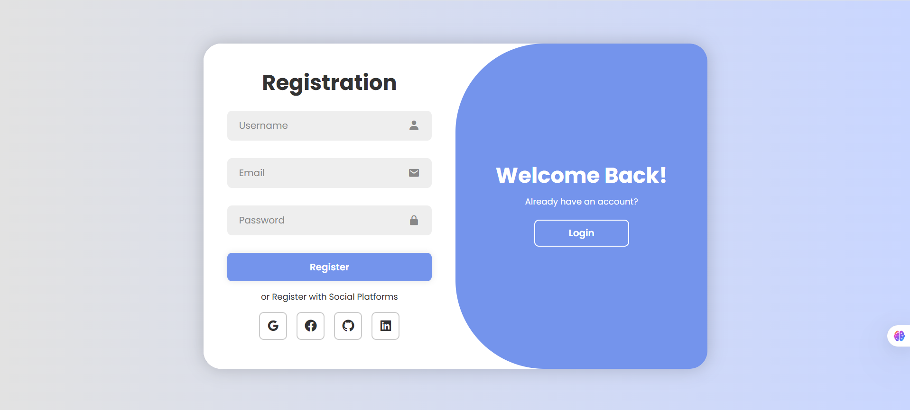

# Responsive Login Page

A responsive and modern login page built with HTML, CSS, and JavaScript, featuring social login icons and a toggle animation between Login and Register forms.

## 🔥 Features

- 💻 Responsive design for desktop and mobile
- 🎨 Clean UI with `Poppins` font and `Boxicons`
- 🔁 JavaScript-powered toggle between Login and Register forms
- 🔐 Input validation for username and password
- 🌐 Social login icons (Google, Facebook, GitHub, LinkedIn)

## 📸 Screenshots

 <!-- Add screenshot image if available -->


## 🚀 Getting Started

### Clone the Repo

```bash
git clone https://github.com/<geeta-seshapalli>/Responsive-login-and-registration-page.git
cd Responsive-login-and-registration-page
